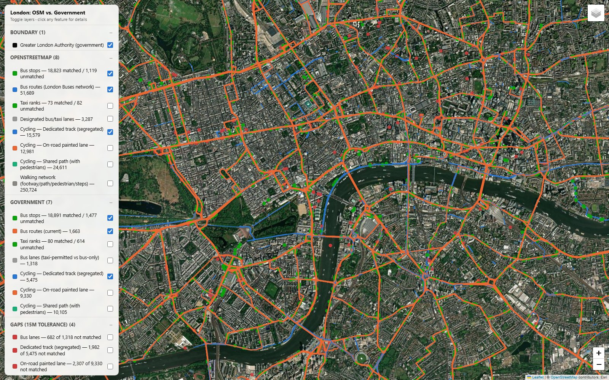
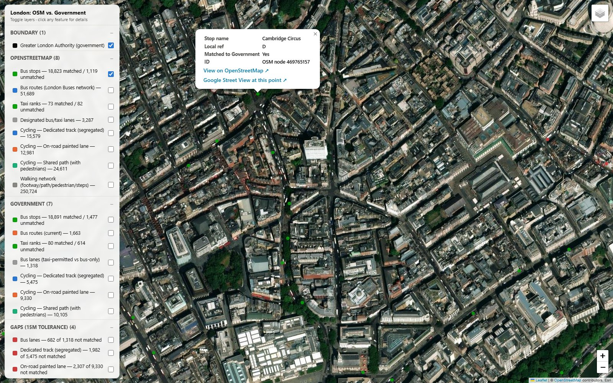

<h1 align="center">London Transport Infrastructure: OpenStreetMap vs. Government Open Data</h1>
<p align="center"><i>A live-data comparison of bus, taxi, cycling and walking infrastructure between OpenStreetMap and Transport for London's open data.</i></p>
<p align="center">
  <a href="https://vamsi9090.github.io/london-mobility-analysis/maps/london_osm_vs_gov_map.html"><strong>▶ Open the live interactive map</strong></a> ·
  <a href="reports/ANALYSIS_REPORT.md">Full analysis report</a> ·
  <a href="#part-of-the-european-mobility-analytics-series">Part of the European Mobility Analytics series</a>
</p>

---

Third city in this series, after [Dublin](https://github.com/vamsi9090/dublin-mobility-analysis) and [Paris](https://github.com/vamsi9090/geo-analysis-report). Same question each time: how complete is OpenStreetMap's picture of a city's transport infrastructure, compared to what the government actually documents — answered with live API queries and real spatial cross-referencing, not headline counts.


*Toggle-able sidebar (grouped OSM / Government / Gaps, each with a live feature count) over Esri satellite imagery. Government routes are rendered in orange, OSM routes in blue — high-contrast by design, not by accident.*


*Click any feature for full detail: name, matched status, its own OSM/TfL identifier, a live link to the source record, and a Google Street View link generated from the exact point clicked.*

## Headline findings

| Question | Answer |
|---|---|
| How well does OSM cover London's registered bus routes? | **84.0%** of TfL's current bus routes have a matching OSM relation — notably higher than Dublin's 50.6%. |
| How well does OSM cover London's bus stops? | **92.7–94.4%** mutual match rate, matched by shared NAPTAN code (not just spatial proximity), median distance 5m. |
| How much of the government bus lane network is missing from OSM? | **~48%** (by length, 15m tolerance) — a real but less severe gap than Dublin's 83%. |
| Are taxi lanes the same as bus lanes in London? | Mostly, not fully — **84% of government bus lanes permit taxis**, but 15.6% are bus-only. OSM under-tags this: only 13.4% of its lane ways carry any taxi tag. |
| How well does OSM cover London's taxi ranks? | Poorly — only **11.5%** of active government ranks have a matching OSM point. The clearest mapping gap this analysis found. |
| Is OSM's cycling data comparable to the government's? | Only once split into 3 real types (dedicated track / on-road lane / shared path) — on-road lanes agree closely (75%), shared paths agree weakly (~45%). |
| Does an official government footpath dataset exist? | No — confirmed by checking specific OS candidates, not assumed. OSM is the only usable source (250,724 ways). |

Full detail, every number sourced and cross-checked, every real ambiguity documented: **[`reports/ANALYSIS_REPORT.md`](reports/ANALYSIS_REPORT.md)**

## The map

**[Live: open in a browser](https://vamsi9090.github.io/london-mobility-analysis/maps/london_osm_vs_gov_map.html)** — or locally: [`maps/london_osm_vs_gov_map.html`](maps/london_osm_vs_gov_map.html) (self-contained, ~87MB — large because London's real network scale is roughly 4x Dublin's: 250,724 walking ways, 51,689 OSM bus-route segments, 75,000+ cycling ways). Toggle-able layers, grouped into a custom sidebar:

- **OpenStreetMap panel**: bus stops (matched/unmatched), bus routes (London Buses network only), taxi ranks (matched/unmatched), designated bus/taxi lanes (colored by taxi tag), cycling by type (3 colors), walking network.
- **Government panel**: the same categories from TfL's own data, plus a **Gaps** section highlighting exactly which government bus lane and cycling segments (by type) have no matching OSM feature within 15m.
- **Every feature is clickable**, not just hoverable: name, type, matched status, its own identifier (OSM node/way ID, or TfL's OBJECTID/FEATURE_ID), a live link to the source record (openstreetmap.org for OSM; a direct ArcGIS query-by-ID link for TfL; TfL's own street-level photo for cycling assets), and a Google Street View link generated from wherever you actually clicked.

## Data sources

**OpenStreetMap** — live Overpass API queries, September 2026, Greater London relation (175342).

**Government (TfL, all fetched live via API):**
| Dataset | Access |
|---|---|
| Bus Stops, Bus Routes, Taxi Ranks, Bus Lanes, Cycle Routes, London Boroughs, GLA boundary | TfL GIS Open Data Hub (ArcGIS FeatureServer) |
| Cycling Infrastructure Database (cycle lane/track segments) | cycling.data.tfl.gov.uk (S3 open data) |

## Repository structure

```
london-mobility-analysis/
├── README.md
├── assets/                       screenshots used in this README
├── reports/ANALYSIS_REPORT.md   full write-up
├── maps/london_osm_vs_gov_map.html
├── src/                          all analysis code, in the order it was run
│   ├── 01_fetch_boundary.py             GLA (gov) + OSM Greater London boundary
│   ├── 02_fetch_gov_data.py             all TfL ArcGIS + CID datasets
│   ├── 03_fetch_osm_data.py             all Overpass queries (bus/taxi/cycling)
│   ├── 04_column_profile.py             profile every field, every dataset
│   ├── 05_spatial_clip.py               boundary agreement + area-normalization check
│   ├── 06_bus_route_comparison.py
│   ├── 07_bus_stop_matching.py          NAPTAN-code-first matching
│   ├── 08_taxi_rank_matching.py
│   ├── 09_bus_taxi_lane_analysis.py     vehicle-permission + buffer-tolerant gap
│   ├── 10_cycling_classification_gap.py 3-type classification on both sides
│   ├── 11_fetch_and_document_walking.py fetch + genuine-search documentation
│   ├── 12_prepare_map_layers.py         simplify + property-strip for the map
│   ├── 13_build_map.py                  the final interactive map
│   └── geo_utils.py                     shared spatial helpers
└── data/
    ├── raw/                       everything fetched live, untouched
    └── processed/                 every intermediate analysis result + map layers
```

## Reproducing this

```bash
pip install -r requirements.txt
cd src
python 01_fetch_boundary.py
python 02_fetch_gov_data.py
# ... run in numeric order; each script documents its sources in its docstring
```

Everything hits live public APIs (Overpass, TfL's ArcGIS hub, TfL's S3 open data bucket) — no API keys required.

## Methodology notes worth having on the record

- The initial OSM cycling query matched on tag *key* presence (`cycleway`-prefixed keys), which pulled in ~21,330 ways whose *value* was `no`/`crossing`/`traffic_island` — explicit absence of infrastructure, not a real segment. Caught by inspecting the "unclassified" bucket before reporting a total, and excluded.
- The bus-route OSM relation query initially included Surrey, Hertfordshire, Kent, National Express and Flixbus routes that happen to pass through Greater London — restricted to `network=London Buses` before comparing against TfL's own route register.
- 5.49% of government bus stops fall outside the GLA boundary (legitimate TfL-contracted routes into neighbouring counties) — excluded from the area-normalized comparison rather than silently left in.
- Buffer-tolerant coverage was computed via point-sampling + nearest-neighbour lookup rather than polygon buffer-and-union, since several of these datasets (up to 75,424 features) are too large for union-based overlap detection to run in reasonable time.

## License

Government data used here is republished under the license terms of the original sources (Open Government Licence v3.0 for TfL/GLA open data). OpenStreetMap data is © OpenStreetMap contributors, ODbL.

## Part of the European Mobility Analytics series

This is one of three city analyses under **[european-mobility-analytics](https://github.com/vamsi9090/european-mobility-analytics)**, the parent project — start there for the cross-city comparison, methodology writeup, and links to all three:

| City | Repo | Live map |
|---|---|---|
| 🇮🇪 Dublin | [dublin-mobility-analysis](https://github.com/vamsi9090/dublin-mobility-analysis) | [open](https://vamsi9090.github.io/dublin-mobility-analysis/maps/dublin_osm_vs_gov_map.html) |
| 🇫🇷 Paris | [geo-analysis-report](https://github.com/vamsi9090/geo-analysis-report) | [open](https://vamsi9090.github.io/geo-analysis-report/maps/paris_osm_vs_gov_map.html) |
| 🇬🇧 London | this repo | [open](https://vamsi9090.github.io/london-mobility-analysis/maps/london_osm_vs_gov_map.html) |
